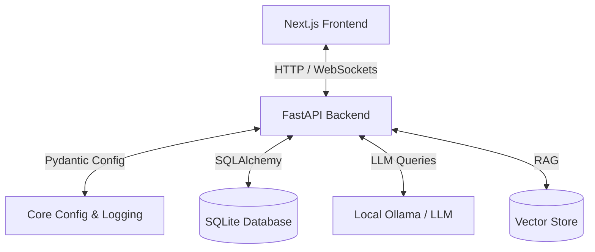

# Personal Agentic AI Assistant

A local-first, zero-budget personal assistant powered by local AI model workflows, vector memory databases, and asynchronous task execution.

## Project Vision
To build a highly modular, autonomous, and private assistant running locally on the user's hardware. The system provides local LLM integration, long-term memory, secure file system access, scheduling, voice interface capabilities, and a Next.js user interface, without requiring paid third-party APIs.

---

## System Architecture Overview

The system is structured as an decoupled application:
1. **Backend**: Built with Python, FastAPI, Uvicorn, SQLAlchemy, SQLite, and Pytest.
2. **Frontend** (Future Phase): Built with Next.js and TailwindCSS.



---

## Technology Stack

### Backend
- **Framework**: FastAPI (Asynchronous API gateway)
- **ASGI Server**: Uvicorn
- **ORM & DB**: SQLAlchemy + SQLite
- **Configuration**: Pydantic Settings
- **Testing**: Pytest & HTTPX

### Core AI & Integrations (Future Phases)
- **Local Inference**: Ollama
- **Storage & Search**: ChromaDB (Vector Store)
- **Task Runner**: Python-dotenv & Background Tasks

---

## Project Roadmap

| Phase | Title | Description | Status |
|---|---|---|---|
| **Phase 1** | **Project Foundation** | FastAPI foundation, logging, DB schema initialization, and health APIs. | **Completed** |
| **Phase 2** | **Local AI Brain & Ollama** | Integration with local LLM APIs via Ollama, agentic planning and basic prompting. | *Next Phase* |
| **Phase 3** | **Memory Systems** | Long-term memory storage via ChromaDB and short-term semantic caching. | *Planned* |
| **Phase 4** | **Voice & Integrations** | Speech-to-Text and Text-to-Speech pipelines. | *Planned* |
| **Phase 5** | **Frontend Client** | Responsive Next.js Web UI. | *Planned* |

---

## Getting Started

To set up the backend on a new Windows laptop:

1. **Clone the repository**:
   ```powershell
   git clone https://github.com/Hamenath/bujji-ai.git
   cd bujji-ai/backend
   ```

2. **Recreate the local environment configuration**:
   ```powershell
   Copy-Item .env.example .env
   ```

3. **Set up virtual environment & install dependencies**:
   ```powershell
   python -m venv .venv
   .\.venv\Scripts\Activate.ps1
   pip install -r requirements.txt
   ```

4. **Pull and run Ollama Model**:
   Ensure [Ollama](https://ollama.com/) is installed and running, then:
   ```powershell
   ollama pull llama3.2
   ```

5. **Run the server**:
   ```powershell
   python -m uvicorn app.main:app --reload
   ```
